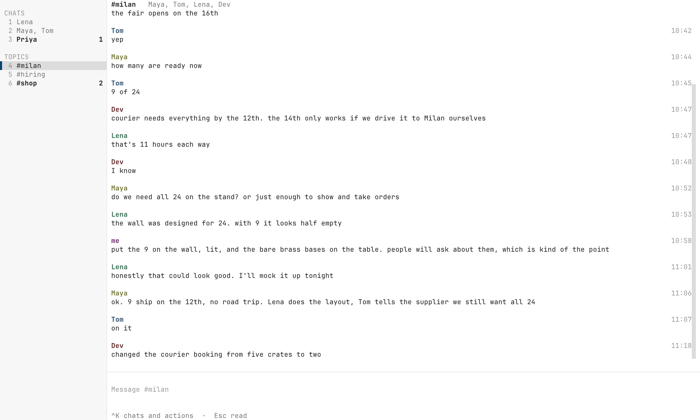

# tlx

Encrypted messaging you can actually understand.

Communicate with people you trust, away from the eyes of modern surveillance and large corporations.

tlx is the smallest possible end-to-end encrypted messaging stack: a relay that
stores what it can't read, and a daemon, `tlxd`, that syncs a local SQLite database with it.

- **No new crypto.** SSH keys for identity, SSH for transport, [age](https://github.com/FiloSottile/age) for encryption,
  SSH signatures for authorship.
- **Small enough to audit.** The relay, sync daemon and Dockerfile together fit in under 500 lines.
- **A server that knows little.** The relay sees encrypted blobs, who they are for and when.
  Never content, never chats.
- **Chats without a server.** A chat is just its signed member list; clients
  derive it themselves.

<br>
<picture>
  <source media="(prefers-color-scheme: dark)" srcset="screenshots/tui-dark.png">
  
</picture>

<p align="center">
  <a href="screenshots/tui-light.png">Light</a> · <a href="screenshots/tui-dark.png">Dark</a>
</p>
<br>

## Quickstart

### Relay

The relay is [under 150 lines of Python](relay.py), with a [Dockerfile under 25 lines](Dockerfile).
Read both to see how it works: OpenSSH authenticates members and runs `relay.py` to store or fetch encrypted messages.

Optionally, build the image locally from the cloned `tlx` directory:

```bash
docker build -t tlx-relay .
```

Run this on a server with Docker, using each member's public key from the client setup below:

```bash
docker run -d --name tlx -p 2222:22 \
  -e TLX_MEMBERS="AAAAC3Nza... AAAAC3Nza..." \
  -v tlx-ssh:/etc/ssh -v tlx-home:/home/tlx \
  achempion/tlx-relay
```

`TLX_MEMBERS` is a space-separated list of public keys. To add a member later, re-create the container
with the longer list; the volumes keep its host key and inboxes.

### Local chat client

You need Git, Python 3.9+, OpenSSH 8.2+ and [age](https://github.com/FiloSottile/age). Clone the project,
install the TUI's dependency and create your identity:

```bash
git clone https://github.com/achempion/tlx.git
cd tlx

python3 -m pip install textual
mkdir -m 700 ~/.tlx
ssh-keygen -t ed25519 -N '' -f ~/.tlx/key
cut -d' ' -f2 ~/.tlx/key.pub
```

Give the printed public key to the relay operator and the people you want to chat with.
Your identity directory, `~/.tlx` by default, holds your key, `tlxd.db` for messages and
`tui.db` for read markers, aliases and settings.

Replace `203.0.113.10` with your relay's address. Connect once to accept its host key, then start the client:

```bash
ssh -i ~/.tlx/key -p 2222 tlx@203.0.113.10    # the relay answers with its usage and hangs up
python3 tui.py --host 203.0.113.10
```

With `--host`, the client starts `tlxd` using `~/.tlx/key`, the private key you created above,
and stops it on exit. Pass `--dir PATH` to choose another identity directory for both the client
and daemon; the daemon uses `PATH/key` and the TUI reads `PATH/key.pub`.

Type `/new PUBLIC_KEY` with another member's key, then send a message. `/help` lists the commands and keys.

## Demo

With the client dependencies installed, try two people on one machine talking through a local relay:
run the commands below from the cloned `tlx` directory in each terminal.

```bash
for who in alice bob; do mkdir -m 700 ~/.tlx-$who && ssh-keygen -t ed25519 -N '' -f ~/.tlx-$who/key; done
ALICE=$(cut -d' ' -f2 ~/.tlx-alice/key.pub); BOB=$(cut -d' ' -f2 ~/.tlx-bob/key.pub)

docker run -d --name tlx -p 127.0.0.1:2222:22 -e TLX_MEMBERS="$ALICE $BOB" \
  -v tlx-ssh:/etc/ssh -v tlx-home:/home/tlx achempion/tlx-relay
ssh -i ~/.tlx-alice/key -p 2222 tlx@127.0.0.1    # accept the host key; the relay answers with its usage and hangs up
```

Terminal 1 is Alice. With `--host`, the client starts its own `tlxd`:

```bash
python3 tui.py --dir ~/.tlx-alice --host 127.0.0.1
```

Terminal 2 is Bob:

```bash
python3 tui.py --dir ~/.tlx-bob --host 127.0.0.1
```

In Alice's terminal type `/new`, a space, and Bob's public key (the value of `$BOB`), then send a message.
It shows as pending until her own copy comes back through the relay, and appears in Bob's terminal a moment later.
Bob just types to reply.

## Architecture

The reference chat client is intentionally split into two components: `tlxd` handles synchronization
and sending, while the TUI handles the interface. SQLite connects the two, keeping the code that
coordinates encryption and delivery small enough to read, audit and use as a reference for other clients.

### Relay

OpenSSH authenticates members and runs `relay.py` for each command. `put` stores an encrypted blob
once and links it into each recipient's inbox. `get` returns new blobs from your inbox by sequence,
waiting up to 60 seconds if there are none yet.

### tlxd

The daemon is [under 350 lines](tlxd.py), including its database schema. It uses OpenSSH and
[age](https://github.com/FiloSottile/age) to sign and encrypt messages from `outbox`, send them to the relay, and decrypt and verify incoming
messages before saving them in `messages`. Both tables live in `tlxd.db`.

### TUI

The [Textual client](tui.py) shows how to build on that database: read messages, insert into `outbox`
to send, and update or remove outbox rows to retry or discard. It keeps read markers, aliases and
the chosen theme in its own `tui.db`, separate from the daemon's schema.

A TUI, GUI or bot can be as elaborate as needed while using this same small database interface.
It delegates cryptography and synchronization to `tlxd`, so interface features can grow independently
of the code that handles encryption and delivery.

## Examples

These examples use the identity from Quickstart. Replace `203.0.113.10` with your relay's address.

### Run the daemon separately

Start the daemon in one terminal, then the client in another:

```bash
python3 tlxd.py --host 203.0.113.10    # --port defaults to 2222, --dir to ~/.tlx
```

```bash
python3 tui.py                       # uses ~/.tlx and the running daemon
```

### Send and read through SQLite

With `tlxd` running, insert into `outbox` to send. `claimed_at` is the send time in Unix nanoseconds;
use a new value for each message. Supply recipients for a new chat; omit them to reply to its known participants.

```bash
BOB=AAAAC3Nza...     # Bob's public key
CHAT="@$(openssl rand -hex 8)"

# start a new chat with Bob
sqlite3 ~/.tlx/tlxd.db "insert into outbox (claimed_at, chat_id, recipient_public_keys, body)
  values ($(python3 -c 'import time; print(time.time_ns())'), '$CHAT', '$BOB', 'hi Bob')"

# once your own copy has arrived, reply to the same chat
sqlite3 ~/.tlx/tlxd.db "insert into outbox (claimed_at, chat_id, body)
  values ($(python3 -c 'import time; print(time.time_ns())'), '$CHAT', 'hello again')"

# read
sqlite3 ~/.tlx/tlxd.db "select chat_id, body from messages order by sequence"
```

`sent_at` records relay acceptance; permanent failures go in `error`, while SSH connection failures
are retried. An outbox row is removed when your own copy arrives. Your key is always included in
the recipients, and each message needs at least one other recipient.

### Use the relay directly

The signed message contains the chat ID, claimed time and recipient keys on its first line,
followed by the body. The relay accepts encrypted blobs up to 1,000,000 bytes, including all overhead.

#### Prepare a message

Set `BOB` to Bob's public key. A new chat gets a random ID; a topic adds a prefix, such as
`launch@<id>`. Replies reuse the full chat ID. Each message needs a fresh `CLAIMED_AT` in Unix nanoseconds.

```bash
ME=$(cut -d' ' -f2 ~/.tlx/key.pub)
BOB=AAAAC3Nza...
CHAT="@$(openssl rand -hex 8)"
CLAIMED_AT=$(python3 -c 'import time; print(time.time_ns())')
printf '%s %s %s %s\nhello\n' "$CHAT" "$CLAIMED_AT" "$ME" "$BOB" > message
```

To use a file as the body, replace the `printf` line with this. Leave room under the size limit
for recipient, encryption and signature overhead.

```bash
{ echo "$CHAT $CLAIMED_AT $ME $BOB"; cat photo.jpg; } > message
```

#### Sign

Sign with your private key. This creates `message.sig`.

```bash
ssh-keygen -Y sign -f ~/.tlx/key -n chat message
```

#### Encrypt and send

Encrypt the message and signature for every recipient, then deliver the blob to their inboxes.

```bash
cat message message.sig \
  | age -r "ssh-ed25519 $ME" -r "ssh-ed25519 $BOB" \
  | ssh -i ~/.tlx/key -p 2222 tlx@203.0.113.10 put $ME $BOB
```

#### Read your inbox

Fetch encrypted blobs after a sequence number. Use `0` to fetch the whole inbox. If there are no
new blobs, the relay waits up to 60 seconds.

```bash
ssh -i ~/.tlx/key -p 2222 tlx@203.0.113.10 get 0
```

## Development

The tests use Python's standard `unittest` runner. The headless TUI cases use temporary SQLite
databases and need only `textual`:

```bash
python3 tests/tui_test.py TuiTests
```

Integration cases run a Docker relay and real daemons using the shared setup in `tests/support.py`.
They need Docker, `ssh`, `ssh-keygen`, `ssh-keyscan` and [age](https://github.com/FiloSottile/age).
The TUI integration case also needs `textual`:

```bash
python3 tests/e2e.py
python3 tests/tui_test.py RelayTests
```

Each case starts fresh. To run one case, append its class and method, such as
`python3 tests/e2e.py MessagingTests.test_connection_retry_and_offline_catchup`.

## Sponsored by

[Tecotype](https://tecotype.com?utm_source=tlx), keyboard-first mail app.
