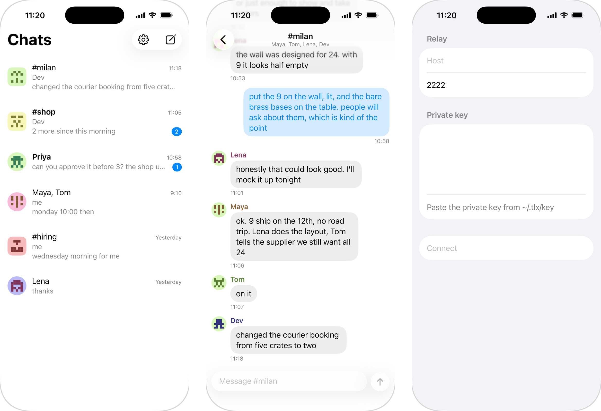

# tlx for iPhone

<picture>
  <source media="(prefers-color-scheme: dark)" srcset="../screenshots/ios-dark.png">
  
</picture>

<p align="center">
  <a href="../screenshots/ios-light.png">Light</a> · <a href="../screenshots/ios-dark.png">Dark</a>
</p>

## Build

Needs Xcode, [XcodeGen](https://github.com/yonaskolb/XcodeGen), Go and
[gomobile](https://pkg.go.dev/golang.org/x/mobile/cmd/gomobile).

```bash
make core project
open tlx.xcodeproj
```

Then pick a simulator and press Run.

## Code map

```
ios/
├─ project.yml          XcodeGen definition; the .xcodeproj is generated from it
├─ Makefile             builds the Go core, generates the project, archives a release
├─ Info.plist           app metadata and background modes
├─ ExportOptions.plist  App Store Connect upload settings
├─ icon.py              draws the icon in Assets.xcassets/
├─ core/                Go: key parsing, age encryption, SSH signatures
├─ Sources/
│  ├─ TlxApp.swift      app entry and sync lifecycle
│  ├─ Identity.swift    the private key, kept in the Keychain
│  ├─ Notifications.swift  local notifications
│  ├─ Sync/             relay protocol and sync.db
│  ├─ Views/            screens and the queries behind them
│  └─ Lib/              thin SSH and SQLite wrappers
└─ Tests/               unit tests
```
