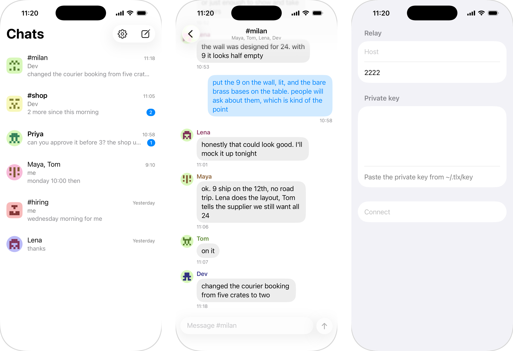
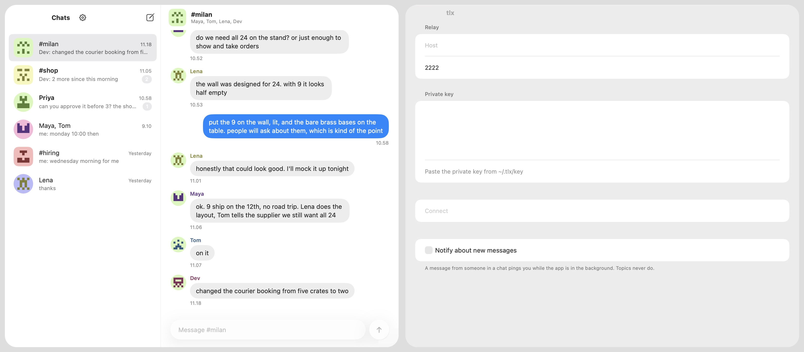

# tlx for iPhone and Mac

## Screenshots

### iPhone

<picture>
  <source media="(prefers-color-scheme: dark)" srcset="../screenshots/ios-dark.png">
  
</picture>

<p align="center">
  <a href="../screenshots/ios-light.png">Light</a> · <a href="../screenshots/ios-dark.png">Dark</a>
</p>

Reach out to me if you want to download the same version from the App Store.

### Mac

<picture>
  <source media="(prefers-color-scheme: dark)" srcset="../screenshots/mac-showcase-dark.png">
  
</picture>

<p align="center">
  <a href="../screenshots/mac-showcase-light.png">Light</a> · <a href="../screenshots/mac-showcase-dark.png">Dark</a>
</p>

## Build

Needs Xcode, [XcodeGen](https://github.com/yonaskolb/XcodeGen), Go and
[gomobile](https://pkg.go.dev/golang.org/x/mobile/cmd/gomobile).

```bash
make core project
open tlx.xcodeproj
```

Then pick an iPhone simulator or **My Mac (Mac Catalyst)** and press Run.

For a Mac build distributed outside the App Store, run `make mac-export` from
this directory and package `build/mac/export/tlx.app`. The Xcode export embeds
the Developer ID provisioning profile required by the app's Keychain entitlement.
Distribute only the Developer ID export, not an app from the archive or
`DerivedData`.

## Code map

```
ios/
├─ project.yml          XcodeGen definition; the .xcodeproj is generated from it
├─ Makefile             builds the Go core, generates the project, exports releases
├─ Info.plist           app metadata and background modes
├─ Mac.entitlements     Mac sandbox, network, and Keychain access
├─ MacExportOptions.plist  Developer ID export settings for Mac
├─ ExportOptions.plist  App Store Connect upload settings
├─ icon.py              draws the icon in Assets.xcassets/
├─ core/                Go: key parsing, age encryption, SSH signatures
├─ Sources/
│  ├─ TlxApp.swift      app entry and sync lifecycle
│  ├─ Identity.swift    the private key, kept in the Keychain
│  ├─ Notifications.swift  local notifications
│  ├─ Sync/             relay protocol and sync.db
│  ├─ Views/            screens and the queries behind them
│  └─ Lib/              thin SSH and SQLite wrappers
└─ Tests/               unit tests
```
